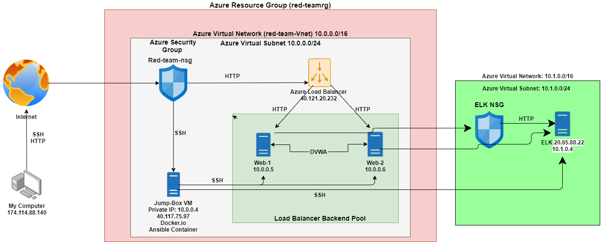
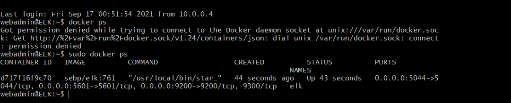

# Cloud-Security-Project
## Automated ELK Stack Deployment

The files in this repository were used to configure the network depicted below.

These files have been tested and used to generate a live ELK deployment on Azure. They can be used to either recreate the entire deployment pictured above. Alternatively, select portions of the filebeat-playbook.yml file may be used to install only certain pieces of it, such as Filebeat.

This document contains the following details:
- Description of the Topologu
- Access Policies
- ELK Configuration
  - Beats in Use
  - Machines Being Monitored
- How to Use the Ansible Build

### Description of the Topology

The main purpose of this network is to expose a load-balanced and monitored instance of DVWA, the D*mn Vulnerable Web Application.

Load balancing ensures that the application will be highly efficient, in addition to protecting against high-traffic to the network.
What aspect of security do load balancers protect? 
- Loadbalancers help mitigate the risk that servers may become overloaded and protect against DDOS attacks to ensure availability. 
- It eliminates single points of failure by rerouting traffic from an overloaded server to other supporting servers.

What is the advantage of a jump box?
- The advantage of a jumpbox is that it decreases the attack surface of a network by allowing access to only one host with a public facing ip address. Jump-hosts should never be used, except for administrative tasks. 

Integrating an ELK server allows users to easily monitor the vulnerable VMs for changes to the network and system logs.
- What does Filebeat watch for? 
-- Filebeat watches for specified log files and locations along with collecting log events. 
- What does Metricbeat record?_
-- Metricbeat records metrics and statistics on your host machines. 

The configuration details of each machine may be found below.

| Name     | Function | IP Address | Operating System |
|----------|----------|------------|------------------|
| Jump Box | Gateway  |20.102.58.138 (Public) 10.0.0.4 (Private)| Linux |
| ELK   | Server | 20.65.88.22(Public)10.1.0.4 (Private)| Linux 
| WEB1  |  Server  |40.121.20.232(Loadbalancer) 10.0.0.5 (Private)|Linux |
|WEB2 |Server|40.121.20.232(Loadbalancer) 10.0.0.6 (Private)| Linux |

### Access Policies

The machines on the internal network are not exposed to the public Internet. 

Only the Jumphost machine can accept connections from the Internet. Access to this machine is only allowed from the following IP addresses:
- Localhost IP Address: 174.114.88.140

Machines within the network can only be accessed by Jumphost machine.
- The Jumphost machine via the d3f4b4dbdf65 container. 

A summary of the access policies in place can be found in the table below.

| Name     | Publicly Accessible | Allowed IP Addresses |
|----------|---------------------|----------------------|
| Jump Box | Yes |  174.114.88.140    |
|    ELK VM      | No  | 10.0.0.4 |
|  WEB1        |No|  10.0.0.4   | 
| Web 2| No| 10.0.0.4

### Elk Configuration

Ansible was used to automate configuration of the ELK machine. No configuration was performed manually, which is advantageous because...
- It allows you the ability to configure multiple machines using one playbook or multiple playbooks rather than having to configure each machine independently, which can lead to human error. 

The playbook implements the following tasks:
- _TODO: In 3-5 bullets, explain the steps of the ELK installation play. E.g., install Docker; download image; etc._
- SSH into Jumphost using ssh sysadmin@20.102.58.38
- Go into docker container (sudo docker start -i d3f4b4dbdf65)
- cd /etc/ansible/roles and created the install-elk.yml playbook (within the Playbook is the YML commands to install Docker.io, install Pip, increase virtual memory, download and launch the docker elk container and Enable service docker on boot)
- Ran the install-elk.yml playbook via ansible-playbook install-elk.yml
- SSH into ELK server to ensure it is up and running properly

The following screenshot displays the result of running `docker ps` after successfully configuring the ELK instance.

### Target Machines & Beats
This ELK server is configured to monitor the following machines:
- _TODO: List the IP addresses of the machines you are monitoring_
-- Web1 (10.0.0.5)
-- Web2 (10.0.0.6)

We have installed the following Beats on these machines:
- Filebeat
- Metricbeat

These Beats allow us to collect the following information from each machine:
- Filebeat collects and transfers log data
- Metricbeat collects and transfers machine metrics such as uptime. 

### Using the Playbook
In order to use the playbook, you will need to have an Ansible control node already configured. Assuming you have such a control node provisioned: 

SSH into the control node and follow the steps below:
- Copy the  filebeat-config.yml file to /etc/ansible/roles.
- Update the filebeat-config.yml file to include the ELK private IP (10.1.0.4) in line 1106 under "elasticsearch output" and line 1806 under the "Kibana Output Configuration" section. 
- Run the playbook, and navigate to http://20.65.88.22:5601/app/kibana to check that the installation worked as expected.

_TODO: Answer the following questions to fill in the blanks:_
- Which file is the playbook? filebeat-playbook.yml 
- Where do you copy it? /etc/ansible/roles
- Which file do you update to make Ansible run the playbook on a specific machine? Hosts file
- How do I specify which machine to install the ELK server on versus which to install Filebeat on? In the hosts file, you would go under "# Ex 2: A collection of hosts belonging to the 'webservers' group and have two sections, one for webservers and the other for your elk server. When you write the YAML scripts for the playbooks, the second category is "hosts" where you specify webservers for the filebeat-playbook.yml and for the install-elk.yml file you specify elk under the hosts category.
- Which URL do you navigate to in order to check that the ELK server is running? http://20.65.88.22:5601/app/kibana 

_As a **Bonus**, provide the specific commands the user will need to run to download the playbook, update the files, etc._

  -------Filebeat and Metricbeat---------

- To create the filebeat-configuration.yml file: nano filebeat-configuration.yml in the etc/ansible/roles directory. 

- Use the YAML scripting language as follows:
  ---
- name: installing and launching filebeat & metricbeat
  hosts: webservers
  become: yes
  tasks:

  - name: download filebeat deb
    command: curl -L -O https://artifacts.elastic.co/downloads/beats/filebeat/filebeat-7.4.0-amd64.deb

  - name: install filebeat deb
    command: dpkg -i filebeat-7.6.1-amd64.deb

  - name: drop in filebeat.yml
    copy:
      src: /etc/ansible/filebeat-config.yml
      dest: /etc/filebeat/filebeat.yml

  - name: enable and configure system module
    command: filebeat modules enable system

  - name: setup filebeat
    command: filebeat setup

  - name: start filebeat service
    command: service filebeat start

  - name: enable service filebeat on boot
    systemd:
      name: filebeat
      enabled: yes

- name: download Metricbeat deb
    command: curl -L -O https://artifacts.elastic.co/downloads/beats/metricbeat/metricbeat-7.4.0-amd64.deb

  - name: install Metricbeat deb
    command: dpkg -i metricbeat-7.4.0-amd64.deb

  - name: drop in Metricbeat.yml
    copy:
      src: /etc/ansible/metricbeat-config.yml
      dest: /etc/metricbeat/metricbeat.yml

  - name: enable and configure system module
    command: metricbeat modules enable docker

  - name: setup metricbeat
    command: metricbeat setup

  - name: run metricbeat
    command: service metricbeat start

  - name: enable service metricbeat on boot
    systemd:
   
   - Run the playbook: ansible-playbook filebeat-playbook.yml
